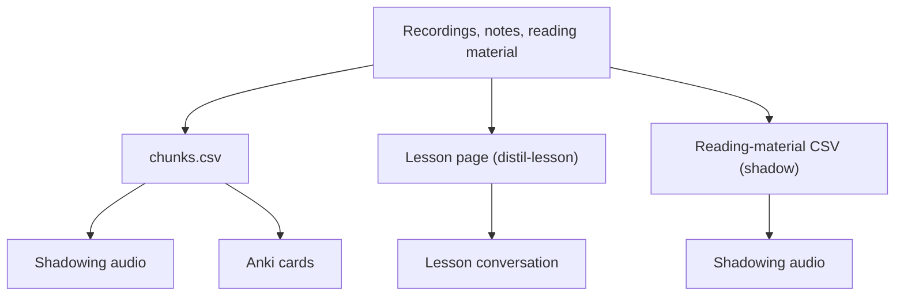

# Kallim — Design Spec

Versioned spec for the personal Arabic learning tool. Derived from the
[Notion design doc](https://app.notion.com/p/371d9af2a63981f3b43ff3ee1cf014ba).
How to *use* it is in [README.md](README.md); this file says why it is shaped
the way it is.

---

## Guiding principle

The learning happens in the ear, the hand, and the mouth — not in the storage
layer. This tool reduces friction and consolidates scattered sources of truth.
Build the minimum that removes the "stuff everywhere" pain, then stop and use it.

---

## The problem it solves

Vocabulary gaps captured all over the place — daily-life gaps, lesson gaps,
notes in Drive/Docs/GitHub, recordings. No single source of truth. This is a
**capture and consolidation** problem, not a learning-algorithm problem.

---

## The split

| Layer       | Role                                    | Where                              |
|-------------|-----------------------------------------|------------------------------------|
| **Capture** | Scrappy inbox. Frictionless dumping.     | Notion page, Doc, voice note, etc. |
| **Store**   | Structured single source of truth.      | `chunks.csv` (version-controlled)  |
| **Study**   | Downstream [render targets](#render-targets). Disposable. | Shadowing MP3s, lesson conversations, Anki deck |

Trying to make one system do all three is what felt unwieldy.

---

## The primitive: chunks, not words

A row is a **chunk** — a phrase with context, not an isolated word. You speak in
collocations, correctly inflected, with grammatical environment attached. Chunks
are mined from **authentic** sources — a teacher's own phrases (or ones she
corrected) and notes you captured yourself — never synthesised from bare word
lists.

---

## Data model

Flat CSV (`chunks.csv`). One chunk per row. Columns:

| Column         | Type     | Description                                                  |
|----------------|----------|--------------------------------------------------------------|
| `id`           | string   | Stable id per row (short hex, e.g. `7f3a1b2c`), assigned by `kallim harvest`. Anki keys each note on it; see [Anki](#2-anki-cards-with-audio-kallim-anki). |
| `arabic`       | string   | The chunk, full tashkeel for MSA, natural form for dialect.   |
| `english`      | string   | Gloss / translation.                                         |
| `register`     | enum     | `msa` / `egyptian` / `iraqi`                                 |
| `topic`        | string   | What the chunk is *about*: one registered slug. `TOPICS` ([scripts/model.py](scripts/model.py)) maps each to a description and is rendered by `kallim tags`; a value outside it is rejected on construction. Which topic is under current study is **not** a column — that is a syllabus question, answered by `--section`. |
| `priority`     | enum     | `high` for a chunk that is structurally high-leverage for building an argument (a frame, connector or stance marker), otherwise `normal`. A fact about the chunk, never learning state. The [chunk-review rubric](.claude/agents/chunk-review.md#4-priority) defines it. |

### Example

```csv
id,arabic,english,register,topic,priority
0dc7e80b,السلام عليكم,Hello / Peace be upon you,egyptian,greetings,normal
2b8c6e03,ممكن أشوف المنيو الأول؟,Can I see the menu first?,egyptian,dining,normal
8c1b3a5e,أَنَا أَتَعَلَّمُ اللُّغَةَ الْعَرَبِيَّةَ,I am learning Arabic,msa,language,normal
f3a6ec53,قَاتَلَ أَبْنَاؤُهُ مَعَهُ فِي المَعْرَكَةِ,His sons fought alongside him in battle,msa,history,normal
```

### The two banks

`chunks.csv` holds the live MSA bank — drilled, rendered, added to. `egyptian.csv`
holds the Egyptian rows, frozen: its job is **reception** (songs, media, a future
trip), not production, so it is out of the default scope.

`kallim prune` reads **both**, and a missing bank is an error rather than an empty
contribution — otherwise every key only that bank produces would look orphaned and
`prune --apply` would delete audio that is still wanted.

### Why CSV

- The data is a flat table — CSV *is* a flat table.
- Version-controlled in git (diffs are readable row-by-row).
- Editable in any spreadsheet app or text editor.
- Python stdlib `csv` module — no extra dependency.
- Trivial to export to/from Google Sheets if that's ever wanted.

---

## Single source of truth

The CSV owns **content**. Anki owns **scheduling state** ("do I know it") — and
that includes flagging a card as one you need to work on, which is why no flag is
ever synced back into the CSV. Never store a learning score in the CSV — that
recreates the original drift problem inside the solution.

---

## Rules for Arabic content

These hold for every piece of Arabic kallim handles, whichever skill or command
produces it. Skills link here rather than keeping their own copies.

- **Numbers in words, never digits, in any Arabic that will be voiced.** The
  voice misreads digits (`٧٦٢` or `762`); a year can come out in the wrong
  order. Write the number as it is said, with its case, e.g. `عَامَ سَبْعِمِئَةٍ
  وَاثْنَيْنِ وَسِتِّينَ` (hundreds, then units, then tens). Spell it `مِئَة`, not
  `مِائَة`, because the voice may sound the silent alif. The English side may
  keep digits.
- **Never name the teacher**, in any output: pages, scripts, audio, chunks,
  notes or filenames. She is `المعلِّمة` as a speaker and `يَا أُسْتَاذَة` in
  address. The repo is public and the lessons are not.
- **Dialect stays dialect.** Egyptian keeps its colloquial forms verbatim
  (`عايز`, `بكام`, `ما ينفعش`); never convert it to Fuṣḥā. In a dialect lesson
  the dialect *is* the target, not an error.
- **Speakers come from the content, not the labels.** Recording diarisation
  sometimes swaps `SPEAKER S1` and `S2`. The student is the one being corrected.
- **Nothing is spent before a dry run.** Every paid render is preceded by its
  dry run (`--dry-run`, or `kallim script` without `--render`), and its cost is
  reported first. **Never `--force` to fix one edit**: the cache already
  re-bills only what changed, and `--force` re-bills everything.

---

## ElevenLabs TTS

### Voice mapping

Voice ids are configuration, never content: the CSV stays pure, and
[README → Configuration](README.md#configuration) lists the variables. Two axes
select a voice:

- a chunk's `register` picks its Arabic voice, with one English voice beside
  them;
- a lesson conversation's `Speaker` picks the voice (see
  [Lesson conversations](#3-lesson-conversations-kallim-script) for why).

Adding a register or a speaker means adding one variable.

### Model

`eleven_multilingual_v2` — supports Arabic (both MSA and Egyptian dialect).

### Output format

`mp3_44100_128` (44.1 kHz, 128 kbps). Sufficient for speech.

### Speech rate

`ElevenLabsSynthesiser._tts` sends exactly four things: the text, the voice id,
the model and the output format. **No `voice_settings`, so no speed, stability
or style parameter is passed at all.** Delivery is therefore whatever each voice
has stored as its own default on the ElevenLabs side, and the place to change it
is their dashboard, not this repo.

Nor is anything slowed down afterwards. The only pydub operations in the
codebase are `_normalize` (gain to −20 dBFS) and concatenation with
`AudioSegment.silent()`. **No time-stretching anywhere.**

Two things make a lesson conversation *feel* slower than the speech actually is:
the 700 ms gap between turns and the 1,600 ms gap at a section break
([scripts/script.py](scripts/script.py)), and fully vocalised Arabic, which gives the model every
short vowel to articulate and tends to draw out delivery relative to bare script.

The SDK does expose `VoiceSettings.speed`, so this is a one-line change if it is
ever wanted — **but read the cache warning below first.**

> **The cache can't see synthesis parameters.** `Utterance.key` is
> `content_hash(register + text)`, and a script `Line`'s key is
> `content_hash(speaker + text)`. Neither covers the model, the output format or
> any voice setting. So changing the speed, swapping a voice id in `.env`, or
> moving to another model leaves every cached clip in place and silently wrong:
> the text didn't change, so nothing regenerates. Fixing that means `--force`
> and paying for the whole bank again — about 75,000 credits across both banks.
> If a synthesis parameter is ever added, it belongs in the cache key in the same
> change. [TODO.md](TODO.md) carries the durable fix, including the re-key migration that
> avoids paying for a rebuild at all.

---

## Audio

### Storage

Audio is a **derived artefact**, not stored in the CSV. Each spoken side is
cached by the hash of its voice key and text: `audio/<content-hash>.mp3` for the
banks, `audio-scripts/<content-hash>.mp3` for lesson conversations. A present
file is correct by construction, so a missing one is simply synthesised again,
and only text that changed is ever re-billed. Shadowing audio and Anki resolve
the same chunk to the same clips.

### What the voice says

A line's text is what you read; the voice says its *spoken* form
(`spoken_text` in [scripts/model.py](scripts/model.py)). A bracketed note is
left unsaid when it is for the reader: a memory aid such as `(lit. every year
may you be well)`, a note holding Arabic, or grammar labels such as `(n.)` or
`(adj.)`. A note that changes which Arabic is right is said, because the prompt
needs it: `(female)`, `(f.)`, `(reply)`, `(two)`. A mixed note keeps only its
cues. Transcripts and Anki cards always show the full text.

The cache key hashes the spoken form, so editing an unsaid note re-bills
nothing, and a line with no notes keys exactly as it would without this rule.

### Audio processing

- Normalise to −20 dBFS (loudness equalisation).
- Silence between clips is plain `AudioSegment.silent()`; its length depends on
  the render target below.

### Error handling

- **No retry.** Any API failure other than a refusal stops the run
  ([scripts/audio.py](scripts/audio.py)).
- **Shadowing audio and Anki skip a content-policy refusal** and log the clip as
  blocked, so one refused line never sinks a whole section. Everything those runs
  log goes to `generate.log` in the run directory; check it after a render.
- **A lesson conversation stops on a refusal instead**, because a skipped turn
  would leave a silent hole mid-dialogue. `kallim script` writes no log file.

---

## Render targets

Shadowing audio and Anki render the chunk bank. Shadowing audio also renders
reading material from an approved transcript. Lesson conversations come from a
lesson recording instead, and share only the audio machinery.

### 1. Shadowing audio (`kallim shadow`, `kallim generate`)

English → pause (you produce) → Arabic (confirms) → pause, line by line.
Recall-then-confirm; overlay your voice onto the Arabic as it is internalised.
Active production, i+0 by design. This is the only thing "shadowing" means in
kallim.

- **One source at a time:** `kallim shadow` renders either an approved
  reading-material transcript (`<slug>-transcript.md`, written by the
  [shadow](.claude/skills/shadow/SKILL.md) skill from a YouTube or podcast
  transcript or any text) or one bank topic (`--topic`). Dry run unless
  `--render`, like `script`. Output: `output/<run>/<slug>.mp3` and `<slug>.md`.
- **The whole bank:** `kallim generate` renders every topic, one MP3 per topic
  and register, named `<nn>_<topic>_<register>`.
- **One transcript layout** for both ([scripts/transcript.py](scripts/transcript.py)):
  a `#` title, `##` sections, numbered pairs, English then Arabic. For reading
  material the same text is the render input, the approved page and the Notion
  page, so what you approve is what is voiced and what you read. The parser is
  strict and refuses, naming the line, a digit in the Arabic or a pair the
  wrong way round.
- **Caches:** bank clips live in `audio/`. Reading-material clips are in no
  bank, so they live in `audio-shadow/`, which `prune` never walks.
- `--pause` sets one gap after each side (2.5 s for `shadow`, 2.0 s for
  `generate`). A line the voice provider refuses is left out whole, English and
  Arabic together, and reported.

### 2. Anki cards with audio (`kallim anki`)

Active recall and testing. Also i+0 by design.

- **Two cards per chunk:** English → Arabic and Arabic → English, each side with
  its audio.
- **Incremental by construction.** The deck is a genanki `.apkg` imported by
  hand; each note's GUID comes from the chunk's `id`, so re-importing updates
  existing cards and keeps their scheduling. Nothing is ever deleted
  automatically.
- Anki keeps scheduling state; the CSV keeps content.

### 3. Lesson conversations (`kallim script`)

A recorded lesson distilled into a clean two-voice dialogue: Arabic at
conversation length, for listening rather than drilling. **Its source is a
lesson recording, not `chunks.csv`** — the same distillation pass also harvests
chunks, but the two outputs are independent and are not derived from each other.

- Input: a conversation page written to the convention in
  [distil-lesson](.claude/skills/distil-lesson/SKILL.md), saved as markdown.
- Two voices in one dialect, so the voice is selected by `Speaker`, not
  `Register`. That is the reason the synthesiser depends on the `Speech` port
  rather than on `Utterance`.
- Arabic only. The English gloss is on the page for reading and is never voiced,
  so a conversation's credit cost is its Arabic character count.
- Fixed gaps between turns and longer ones at a section break (values under
  [Speech rate](#speech-rate)); no pause to speak in.
- Cached in `audio-scripts/`, deliberately apart from `audio/`: `prune` deletes
  anything in `audio/` that no chunk produces, which would be every turn.
- Output: `output/<run>/<name>.mp3` and a numbered transcript 1:1 with the page.

### 4. Podcast-style CI (future)

Passive listening — comprehensible input with scaffolding. The bank is a
to-learn pile, so the podcast generates *around* the chunks with settled
connective material, not just restitching them.

---

## Pipeline



One recorded lesson feeds two arms — chunks from its repair points, a
conversation from its substance — but each is distilled from the raw transcript
directly. Deriving the chunks from the finished conversation instead would lose
every correction the distillation smoothed away, which is the material worth
keeping.

---

## Commands and configuration

Every `kallim` command, with its flags, is in
[README → Commands](README.md#commands), and the `.env` variables are in
[README → Configuration](README.md#configuration). Dependencies are in
`pyproject.toml`; the one system dependency is `ffmpeg`, which pydub needs for
MP3 encoding.

---

## Project structure

```
kallim/
├── cli.py               # the `kallim` entrypoint
├── pyproject.toml       # package config, dependencies, console script
├── README.md            # how to use it
├── DESIGN.md            # this file
├── CLAUDE.md            # project instructions for Claude Code
├── TODO.md              # open work and the backlog
├── chunks.csv           # the live MSA bank
├── egyptian.csv         # the frozen Egyptian bank
├── .env.example         # template for the gitignored .env
├── scripts/             # all Python modules
│   ├── model.py         # domain types: Utterance, Chunk, Speaker, Speech, TOPICS
│   ├── chunks.py        # the chunks.csv loader and the Chunks collection
│   ├── config.py        # paths and constants
│   ├── command.py       # what generate and anki share: scoping, dry runs
│   ├── cache.py         # content-addressed audio cache + mp3 codec
│   ├── audio.py         # ElevenLabs adapter, quota, stitching
│   ├── shadow.py        # shadowing audio from one transcript or topic
│   ├── transcript.py    # the one shadowing transcript layout
│   ├── generate.py      # shadowing audio for every topic
│   ├── generate_anki.py # Anki deck
│   ├── script.py        # lesson page -> two-voice conversation MP3
│   ├── harvest.py       # vocab candidates -> appended, validated chunks
│   ├── lint.py          # bank validation
│   ├── plan.py          # dry-run cost reporting
│   ├── prune.py         # orphaned-audio deletion
│   ├── tags.py          # the topic registry, rendered
│   └── utils.py         # ids, hashing, Arabic normalisation, CSV io, run dirs
├── tests/               # pytest suite
├── .claude/             # skills, the chunk-review agent, the session hook
├── audio/               # cached bank clips (content-addressed; prune walks this)
├── audio-scripts/       # cached conversation clips (prune never walks this)
├── audio-shadow/        # cached reading-material clips (prune never walks this)
├── scratch/             # working files (gitignored)
└── output/              # one flat timestamped dir per run (gitignored)
```

---

## Scope discipline

Three outputs — shadowing audio, lesson conversations and an Anki deck — over
one six-column bank. A new output, or a new column, needs a month of daily use
of these first; anything else is the avoidance trap. The product idea stays
parked until it works for Dave.
